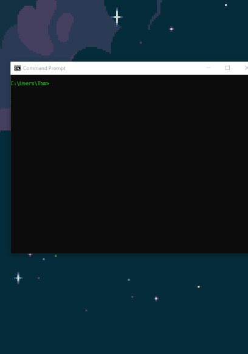

# Simple YouTube Downloader


## Installation
* Currently there is only support for **Windows**.
* **Chrome** is required for the application to run as intended.
```
pip install sytd
# or
easy_install sytd
```

## Usage
```
python -m sytd
# or
simple-youtube-downloader
# or
sytd
```

## Contact
If you have any suggestions of improvement [join my discord](https://discord.gg/DHnBsRZ) or message me directly: Neo#3385
